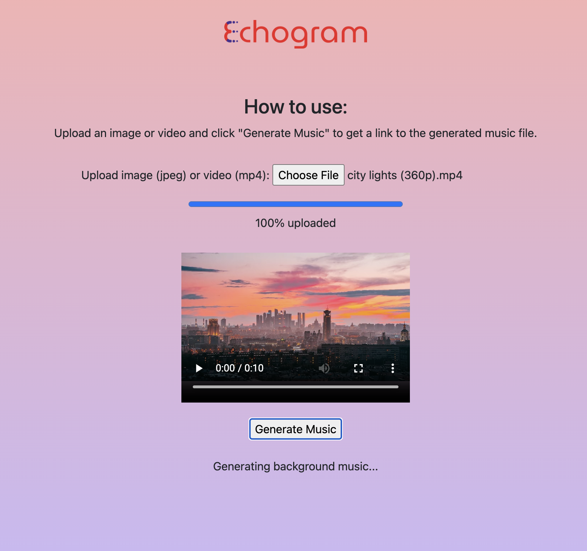

# Echogram
A simple video-to-music webapp. Upload an image or video and click "Generate Music" to get a link to the generated music file.

## Setup

Instructions on installing dependencies (fastapi, unicorn): https://intellipaat.com/blog/what-is-fast-api/

Run project with: uvicorn server:app --reload

## Models (via Replicate)

Video-LLaVA: https://replicate.com/nateraw/video-llava

AudioLDM: https://replicate.com/haoheliu/audio-ldm

MAGNeT: https://replicate.com/lucataco/magnet
